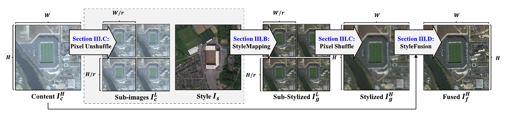
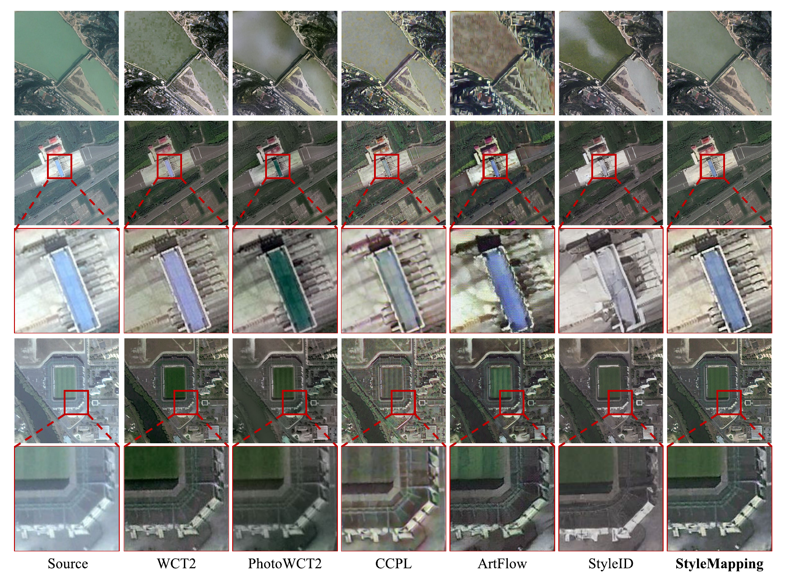
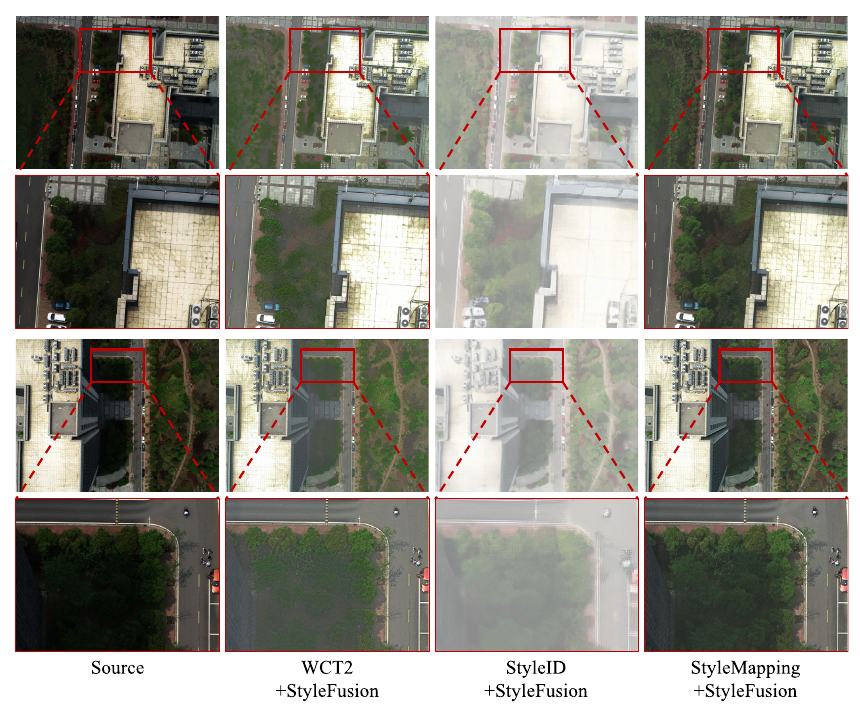

# A Universal Framework for Remote Sensing Image Color Correction via Style Transfer

Official PyTorch implementation of **A Universal Framework for Remote Sensing
Image Color Correction via Style Transfer**, published in *IEEE Transactions on
Geoscience and Remote Sensing* (TGRS), 2026.

[](https://doi.org/10.1109/TGRS.2026.3702755)


[](LICENSE)

[中文复现指南](docs/README_CN.md) ·
[Citation](#citation)

## Overview

Color inconsistency caused by different sensors, illumination, atmospheric
conditions, and acquisition times can reduce the reliability of remote-sensing
analysis. This project formulates reference-guided color correction as a
photorealistic style-transfer problem and combines three components:

- **StyleMapping** transfers color statistics from a reference image while
  preserving the spatial structure of the content image.
- **Pixel unshuffle/shuffle** processes ultra-high-resolution images without
  independent patch-wise stylization, reducing color discontinuities and seams.
- **StyleFusion** uses discrete wavelet transform (DWT) and adaptive subband
  fusion to restore fine structural details in the stylized result.

<p align="center">
  
</p>

<p align="center"><em>
Overview of the proposed framework: pixel unshuffle, StyleMapping, pixel
shuffle, and StyleFusion.
</em></p>

For moderate-resolution images, StyleMapping can be used independently. For
large remote-sensing images, the complete pipeline is recommended.

## Highlights

- Reference-guided, arbitrary photorealistic color transfer.
- Learnable normalized deterministic neural style mapping (NDNSM).
- Globally consistent ultra-high-resolution processing with pixel
  unshuffle/shuffle.
- Lightweight DWT-based structure and style fusion.
- Unified inference for individual images and directories.
- Training scripts for both stages and instructions for installing pretrained
  checkpoints separately.

## Qualitative Results

<p align="center">
  
</p>

<p align="center"><em>
Qualitative comparison on the DIOR dataset. StyleMapping is shown in the
rightmost column and preserves fine structures while aligning the reference
color distribution.
</em></p>

<p align="center">
  
</p>

<p align="center"><em>
High-resolution color-correction results on the SCHOOL dataset. StyleFusion
restores local structures after global StyleMapping processing.
</em></p>

## Repository Structure

```text
.
├── inference.py                  # Unified two-stage inference
├── requirements.txt
├── assets/                       # Pipeline and qualitative figures
├── examples/                     # Example content and reference images
├── style_mapping/
│   ├── net.py                    # StyleMapping / NDNSM implementation
│   ├── train.py                  # StyleMapping training
│   ├── test.py                   # Original research inference script
│   ├── experiments/              # Downloaded StyleMapping checkpoints
│   └── models/                   # Downloaded VGG-19 encoder weights
├── style_fusion/
│   ├── fusion.py                 # DWT StyleFusion network
│   ├── train_all_loss.py         # StyleFusion training
│   ├── test.py                   # Original stage-one test script
│   ├── test_w_fusion_DWT.py      # Original complete two-stage test
│   ├── large_image_process/      # Pixel unshuffle/shuffle and tiling
│   ├── experiments/              # Downloaded StyleFusion checkpoints
│   └── models/                   # Downloaded VGG-19 encoder weights
├── scripts/
│   └── check_weights.py         # Verify downloaded checkpoints
└── docs/
    └── README_CN.md              # Detailed Chinese reproduction guide
```

## Installation

The experiments in the paper were conducted on Ubuntu 22.04 with one NVIDIA
RTX 3090 GPU. Python 3.8–3.10 is recommended.

```bash
conda create -n stylemapping python=3.10 -y
conda activate stylemapping
pip install -r requirements.txt
```

For exact reproduction of the original CUDA 11.7 environment, install PyTorch
before the remaining dependencies:

```bash
pip install torch==1.13.1+cu117 torchvision==0.14.1+cu117 \
  --extra-index-url https://download.pytorch.org/whl/cu117
pip install -r requirements.txt
```

The optional GeoTIFF research script
`style_fusion/test_w_fusion_DWT_gdal.py` additionally requires GDAL. The unified
entry point uses Pillow and does not require GDAL.

## Pretrained Models

Model weights are distributed separately and are **not included in this Git
repository**. The public download link has not been published yet. Download
availability, installation instructions, and checksums are documented in the
[pretrained model guide](docs/PRETRAINED_MODELS.md).

After obtaining the checkpoint archive, extract it in the repository root and
verify the three models required by the default pipeline:

```bash
tar -xzf /path/to/stylemapping-stylefusion-checkpoints.tar.gz -C .
python scripts/check_weights.py
```

The extracted checkpoints must use the following locations:

| Model | Training domain | Path |
|---|---|---|
| VGG-19 encoder | ImageNet | `style_fusion/models/vgg_normalised.pth` |
| StyleMapping | Natural images / COCO | `style_mapping/experiments/photorealistic/NDNSMDecoder.pth.tar` |
| StyleMapping | Remote sensing / DIOR | `style_mapping/experiments/DIOR/NDNSMDecoder.pth.tar` |
| StyleMapping, default | Remote sensing | `style_fusion/experiments/photorealistic_remote_sence/NDNSMDecoder_iter_160000.pth.tar` |
| StyleFusion, default | DIOR, 1024 px | `style_fusion/experiments/DWTFusionNet_content_size=1024_l1+all_loss/StyleFusion_iter_100000.pth.tar` |

The inherited directory name `remote_sence` is intentionally retained for
compatibility with the original research scripts.

Natural-image training checkpoints and ablation models are optional for the
default inference pipeline. To verify every checkpoint in the archive, run
`python scripts/check_weights.py --all`. Git LFS is not needed for this
code-only repository.

## Quick Start

### Complete high-resolution pipeline

```bash
python inference.py \
  --content examples/content.jpg \
  --style examples/style.jpg \
  --output outputs/example \
  --target-size 1024 \
  --style-size 512 \
  --mapping-batch-size 1 \
  --fusion-patch 1024 \
  --fusion-overlap 64 \
  --fusion-batch-size 2 \
  --device cuda:0
```

The command produces:

```text
outputs/example/
├── stage1_style_mapping/        # StyleMapping result
└── stage2_style_fusion/         # Final color-corrected result
```

### StyleMapping only

For moderate-resolution images, StyleFusion can be disabled:

```bash
python inference.py \
  --content examples/content.jpg \
  --style examples/style.jpg \
  --output outputs/mapping_only \
  --mapping-only \
  --target-size 0 \
  --device cuda:0
```

### Directory inference

Both `--content` and `--style` accept an image or a directory. When both are
directories, all content/reference combinations are processed.

```bash
python inference.py \
  --content /path/to/content_images \
  --style /path/to/reference_images \
  --output outputs/batch \
  --device cuda:0
```

Use `--device cpu` when CUDA is unavailable. CPU inference is supported but can
be slow for high-resolution images.

## Important Inference Parameters

The pipeline contains two distinct spatial sizes:

| Parameter | Default | Description |
|---|---:|---|
| `--target-size` | 1024 | Size of each pixel-unshuffled StyleMapping subimage; use `0` to disable pixel unshuffle |
| `--style-size` | 512 | Square reference-image size used by StyleMapping |
| `--mapping-batch-size` | 1 | Number of unshuffled subimages processed together |
| `--fusion-patch` | 1024 | StyleFusion sliding-window size |
| `--fusion-overlap` | 64 | Overlap between adjacent fusion windows |
| `--fusion-batch-size` | 2 | Number of fusion windows processed together |

Given a content image of size `H × W`, the pixel-unshuffle factor is computed as

```text
r = ceil(max(H, W) / target_size)
```

The image is padded when necessary and rearranged into `r²` globally aligned
subimages. After StyleMapping, pixel shuffle reconstructs the original
resolution. StyleFusion then refines the reconstruction with overlapping DWT
fusion windows.

For GPUs with less memory, a conservative configuration is:

```bash
--target-size 512 \
--mapping-batch-size 1 \
--fusion-patch 512 \
--fusion-overlap 32 \
--fusion-batch-size 1
```

See the [Chinese reproduction guide](docs/README_CN.md) for detailed parameter
explanations and training commands.

## Training

### Stage 1: StyleMapping

StyleMapping is trained on MS COCO using random `256 × 256` crops, a batch size
of 8, and 160,000 iterations. The remote-sensing model can then be fine-tuned on
DIOR or another target dataset.

```bash
cd style_mapping
python train.py \
  --content_dir /path/to/coco/train2014 \
  --style_dir /path/to/coco/train2014 \
  --vgg models/vgg_normalised.pth \
  --NDNSMDecoder experiments/photorealistic/NDNSMDecoder.pth.tar \
  --training_mode photorealistic \
  --save_dir experiments/coco_finetune \
  --log_dir logs/coco_finetune \
  --lr 1e-4 \
  --lr_decay 6.25e-6 \
  --batch_size 8 \
  --max_iter 160000 \
  --gpu 0
```

### Stage 2: StyleFusion

StyleFusion is trained on DIOR with `1024 × 1024` inputs, a batch size of 4, a
learning rate of `1e-4`, and 100,000 iterations.

```bash
cd style_fusion
python train_all_loss.py \
  --data_root /path/to/fusion_dataset \
  --save_dir experiments/DWTFusionNet_content_size=1024_l1+all_loss_new \
  --vgg models/vgg_normalised.pth \
  --content_size 1024 \
  --loss l1 \
  --batch_size 4 \
  --max_iter 100000 \
  --save_model_interval 5000 \
  --gpu 0
```

The StyleFusion training dataset must contain corresponding files in:

```text
fusion_dataset/
├── content/
├── style/
├── stage0/                      # Direct high-resolution StyleMapping target
├── stage1/                      # Unshuffled subimage results
└── stage2/                      # Pixel-shuffle reconstruction
```

## Evaluation

The repository retains the original evaluation scripts for:

- Structural similarity (SSIM)
- Learned perceptual image patch similarity (LPIPS)
- Single-image Fréchet inception distance (SIFID)
- Content and style losses
- Video temporal consistency

They are available under `style_mapping/utils`, `style_mapping/LPIPS`,
`style_mapping/SIFID`, and the corresponding StyleFusion directories.

## Notes

- This is a reference-guided method; result quality depends on the selected
  reference image.
- The method targets photorealistic appearance consistency. It is not a
  substitute for physically based atmospheric or radiometric correction.
- The unified Pillow-based inference preserves image dimensions but does not
  write GeoTIFF projection or geotransform metadata. Use or adapt the GDAL
  research script when geospatial metadata must be retained.
- Some original research scripts retain machine-specific default paths. Pass
  dataset and output paths explicitly, or use the portable root-level
  `inference.py`.

## Citation

If this work is useful in your research, please cite:

```bibtex
@article{yue2026universal,
  title   = {A Universal Framework for Remote Sensing Image Color Correction via Style Transfer},
  author  = {Yue, Dongdong and Liu, Xinyi and Fan, Weiwei and Zhong, Jiachen and Liu, Xiaoan and Zhang, Yongjun},
  journal = {IEEE Transactions on Geoscience and Remote Sensing},
  volume  = {64},
  year    = {2026},
  doi     = {10.1109/TGRS.2026.3702755}
}
```

## Contact

For questions about the paper or implementation, please contact Dongdong Yue
at `yueyisui@whu.edu.cn`.

## License

The source code in this repository is released under the
[MIT License](LICENSE). Third-party datasets, pretrained weights, example
images, and figures from the published paper remain subject to their
respective licenses and terms of use.
